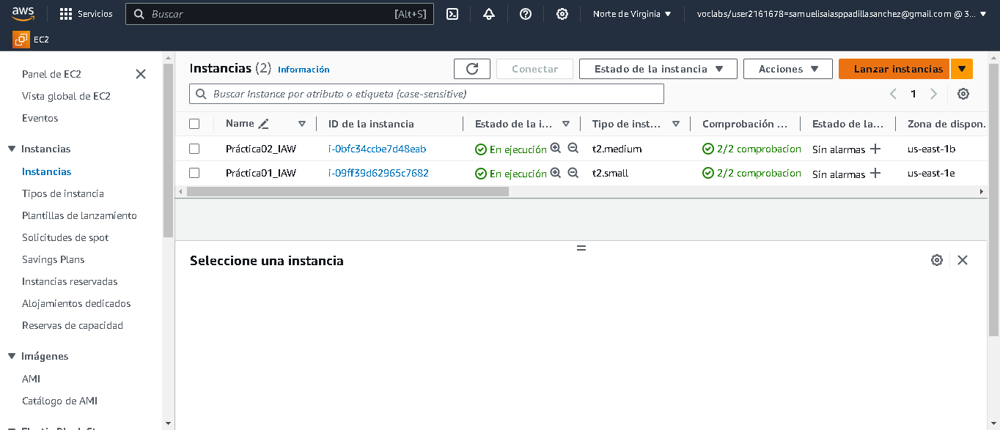

# Instalación de una pila LAMP en RedHat
## Creación de una máquina instancia EC2 en AWS
Para crear nuestra instancia EC2, vamos a Amazon EC2 en la consola AWS. Hacemos click al botón naranja **"Lanzar Instancia"** para abrir el asistente de creación de asistencias.

### 1. Elegimos una AMI (Amazon Machine Image)
En este caso seleccionaremos el AMI de Ubuntu Server 22.04

### 2. Seleccionamos un tipo de instancia

En la segunda pantalla del asistente de EC2, seleccionamos un tipo de instancia EC2. Un tipo de instancia es una configuración particular de CPU, memoria (RAM), almacenamiento y capacidad de red.

AWS tiene una amplísima selección de tipos de instancias que abarca diferentes tipos de cargas de trabajo.

**⚠️!!!IMPORTANTE¡¡¡⚠️**

Tenemos que tener en cuenta en el apartado de "Configuración de red" el marcar las casillas para permitir el tráfico en HTTP y HTTPS ya que serán necesarias en la práctica.

Ya realizada toda la configuración que tendrá nuestra instancia solo nos faltará dar clic al botón naranja **"Lanzar instancia"**.

### 3. IP elástica

Ya creada la instancia, la página nos asignara una IP por defecto que continuamente va cambiando debido a la escasez de IPs (ya que estas no son ilimitadas). Asignaremos este tipo de IP a nuestra instancia para asi tener una IP estática que no va cambiando diariamente que es diseñada en la nube dinámica.

Para acceder a este servicio nos iremos a :
- Servicios (Arriba a la izquierda del inicio de AWS)
  - Red y seguridad
    - Direcciones IP elástica

Empezaremos la creación de nuestra nueva IP elástica dandole clic a **"Asignar la dirección IP elástica"**.

Al darle clic nos aparecera una ventana donde podremos seleccionar el grupo fronterizo de red, direcciones ip elásticas globales y etiquetas. Cuando realizamos la configuración que mas se adapte a nestras necesidas daremos clic a **"Asignar"**.

Para asignar esta IP elástica desde el mismo servicio seleccionaremos nuestra IP elástica y le daremos clic a **"Acciones > Asociar la dirección IP elástica"**.

### 4. Obtener una clave SSH
Para obtener esta clave lo que haremos es dar clic a :

- Panel de control
  - Seleccionamos nuestro curso
    - Contenidos
      - Laboratorio para el alumnado
        - AWS Details
          - Dowload PEM

Antes de iniciar la máquina tendremos que cambiar los permisos del vockey.pem

En el caso de **Windows**, para poder cambiar los permisos he utilizado **Git Bash** (una aplicación para entornos de Microsoft Windows que ofrece una capa de emulación para una experiencia de líneas de comandos de Git) que me permite realizar los cambios de permisos de manera más sencillas al usar comandos linux.

Lo único que tendremos que hacer sera acceder al directorio por el comando **cd** y ponerle de permisos **chmod 700**.

### 5. Conexión a nuestra instancia por ssh desde Visual Studio Code

Antes de empezar la conexion por ssh nos tendremos que instalar una extensión en nuestro Visual Studio Code llamada **"Remote - SSH"** y de forma complementaria su otra extensión **"Remote - SSH: Editing Configuration Files"**.

Instaladas las extensiones procederemos a editar el archivo **/"Usuario"/.ssh/config** dandole al engranaje que se encuentra al lado de **SSH**

Dentro del archivo escribiremos editaremos las lineas de este archivo de esta manera

~~~
Host Nombre del host de la máquina

  HostName (DNS público que se consigue en **EC2 > Instancias > Conectar > Cliente SSH**)

  
  IdentityFile (La dirección de la ubicación del archivo vockey.pem)

  User (Nombre de usuario asignado a la máquina que se encuntra en **EC2 > Instancias > Conectar > Conexión de la instancia EC2)
~~~

Ahora solo nos queda conectarnos a nuestra instanca por ssh dando clic derecho a nuestra instancia y elegir la conexion en la ventana actual o abrir una nueva ventana.

## Instalación de la pila LAMP en la instancia

### .sh de pila LAMP

Lo primero de todo será realizar una carpeta en nuestra máquina para guardar todos nuestros scripts y poder localizarlos facilmente.

Ya creada la carpeta nos tocará realizar nuestro archivo **.sh** donde realizaremos la instalación de nuestra pila LAMP ( en nuestro caso lo hemos llamado **"install_lamp.sh"**). También hay que darle los permisos correspondiente al archivo  que serían **chmod 700**.

**⚠️!!!IMPORTANTE¡¡¡⚠️**

A la hora de realizar todos nuestros scripts es importante escribir estos dos comandos:

~~~
#!/bin/bash
~~~

Con este comando indicamos al sistema operativo que inicie el shell especificado para ejecutar los comandos que siguen en el script.

~~~
set -x
~~~

Habilitamos para que se muestre los comandos que se van ejecutando.

Ya aprendido todo esto, podemos continuar con la creación de nuestro script.

#### 1. Actualizar los paquetes

~~~
apt update -y
~~~

#### 2. Instalamos el servidor web Apache

~~~
dnf install httpd -y
~~~

#### 3. Iniciamos el servicio de Apache

~~~
apt install mysql-server -y
~~~

#### 4. Configuramos para que el servicio se inicie automáticamente

~~~
systemctl enable httpd
~~~

#### 5. Instalamos MySQL Server

~~~
dnf install mysql-server -y
~~~

#### 6. Iniciamos el servicio de  MySQL

~~~
systemctl start mysqld
~~~

#### 7. Configuramos el servicio para que se inicie automáticamente en cada reinicio

~~~
systemctl enable mysqld
~~~

#### 8. Instalamos PHP

~~~
dnf install php -y
~~~

#### 9. Instalamos la extensión de PHP para MySQL

~~~
dnf install php-mysqlnd -y
~~~

#### 10. Reiniciamos el servicio Apache 

~~~
systemctl restart httpd
~~~

#### 11. Copiamos el archivo info.php en var/www/html 

~~~
cp ../php/info.php /var/www/html
~~~

#### 12. Cambiamos el propietario y el grupo de directorio /var/www/html

~~~
chown -R apache:apache /var/www/html
~~~

### .sh de herramientas de la pila LAMP

Ya realizado esste script, nos tocará realizar otro archivo .sh donde realizaremos instalaciones de ciertas herramientas para nuestra pila LAMP y su debida configuración.
Antes de empezar con el script, tendremos que crear una carpeta dentro de nuestra práctica (**"php/info.php"**) donde guardaremos ciertos datos y configuraciones de las herramientas instaladas. También realizaremos un archivo **".env"** donde se especifica el valor de unos variables que usaremos más adelante. A continuación les enseñaré la estructura del script **"install_tools.sh"**:

El contenido del **.env** es el siguiente:

~~~
PMA_USER=pma_user
PMA_PASS=pma_pass
PMA_DB=phpmyadmin
~~~

El contenido del **info.php** es el siguiente:

~~~
<?php

phpinfo();

?>
~~~

Ya sabiendo el contenido de ambas carpetas podemos proseguir con el **.sh**:

~~~
!/bin/bash
~~~

~~~
set -x
~~~

#### 1. Importamos el script de variables de entorno

El comando que se escribe en el .sh es el siguiente:

~~~
source .env
~~~

#### 2. Actualizamos los paquetes

~~~
dnf update -y
~~~

#### 3. Instalamos los módulos de PHP necesarios para phpMyAdmin

~~~
sudo dnf install php-mbstring php-zip php-json php-gd php-fpm php-xml -y
~~~

#### 4. Reiniciamos el servicio Apache 

~~~
systemctl restart httpd
~~~

#### 5. Instalamos la utilidad wget

~~~
dnf install wget -y
~~~

#### 6. Eliminamos descargas previas de phpMyAdmin

~~~
rm -rf /tmp/phpMyAdmin-5.2.1-all-languages.zip
~~~

#### 7. Descargamos código fuente de phpMyAdmin

~~~
wget https://files.phpmyadmin.net/phpMyAdmin/5.2.1/phpMyAdmin-5.2.1-all-languages.zip -P /tmp
~~~

#### 8. Instalamos utilidad unzip

~~~
dnf install unzip -y
~~~

#### 9. Descomprimimos el codigo fuente de phpMyAdmin en /var/www/html

~~~
unzip /tmp/phpMyAdmin-5.2.1-all-languages.zip -d /var/www/html -y
~~~

#### 10. Renombramos el directorio phpMyAdmin

~~~
mv /var/www/html/phpMyAdmin-5.2.1-all-languages /var/www/html/phpmyadmin
~~~

#### 11. Actualizamos los permisos del directorio /var/www/html

~~~
chown -R apache:apache /var/www/html
~~~

#### 12. Creamos un archivo de configuración a partir del archivo de ejemplo 

~~~
cp /var/www/html/phpmyadmin/config.sample.inc.php /var/www/html/phpmyadmin/config.inc.php
~~~

#### 13. Generamos un valor aleatorio de 32 caracteres para la variable blowfish_secret

~~~
RANDOM_VALUE=`openssl rand -hex 16`
~~~

#### 14. Modificamos la variable blowfish_secret en el archivo de configuración

~~~
sed "/blowfish_secret/a \$cfg\['TempDir'\] = '/tmp';" /var/www/html/phpmyadmin/config.inc.php
~~~

#### 15. Eliminamos si existe alguna base de datos previa de phpMyAdmin

~~~
mysql -u root <<< "DROP DATABASE IF EXISTS phpmyadmin"
~~~

#### 16. Importamos el script de creación de base de datos de phpMyAdmin

~~~
mysql -u root < /var/www/html/phpmyadmin/sql/create_tables.sql
~~~

#### 17. Creamos el usuario para la base de datos y le asignamos privilegios

~~~
mysql -u root <<< "DROP USER IF EXISTS $PMA_USER@'%'"
mysql -u root <<< "CREATE USER $PMA_USER@'%' IDENTIFIED BY '$PMA_PASS'"
mysql -u root <<< "GRANT ALL PRIVILEGES ON $PMA_DB.* TO $PMA_USER@'%'"
~~~
